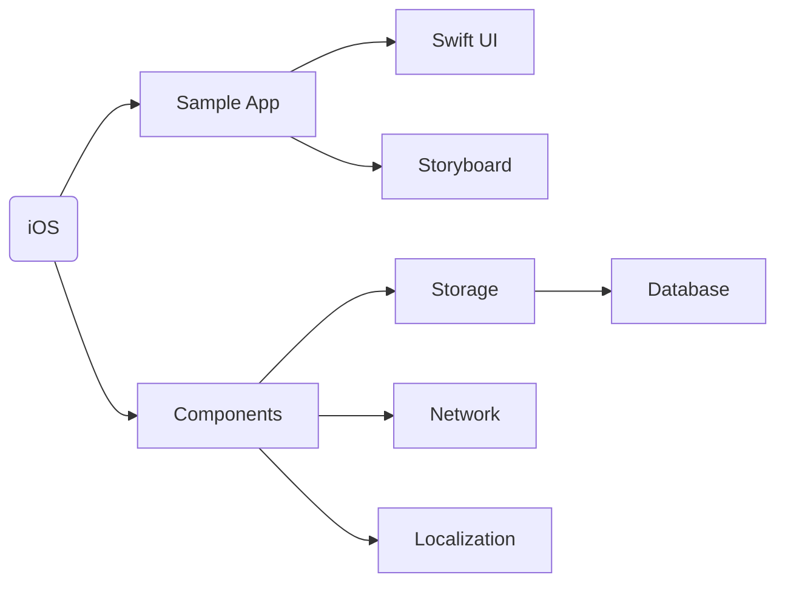

# iOS Components

```mermaid
graph LR

A(iOS)

A --> B[Sample App]
A --> C[Components]

B --> B1[Swift UI]
B --> B2[Storyboard]

C --> C1[Storage]
C --> C2[Network]
C --> C3[Localization]

C1 --> C11[Database]

```
