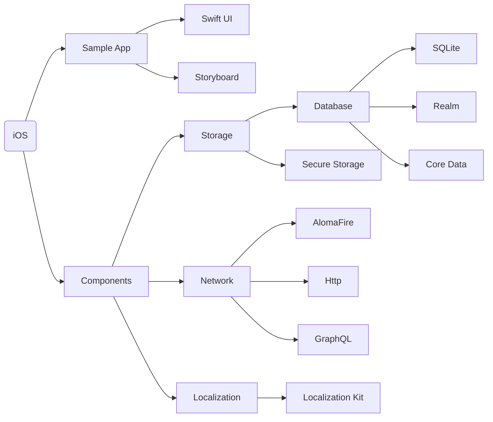

# iOS Components

```mermaid
graph LR

A(iOS)

A --> B[Sample App]
A --> C[Components]

B --> B1[Swift UI]
B --> B2[Storyboard]

C --> C1[Storage]
C --> C2[Network]
C --> C3[Localization]

C1 --> C11[Database]
C1 --> C12[Secure Storage]

C11 --> C111[SQLite]
C11 --> C112[Realm]
C11 --> C113[Core Data]

C2 --> C21[AlomaFire]
C2 --> C22[Http]
C2 --> C23[GraphQL]

C3 --> C31[Localization Kit]

```
